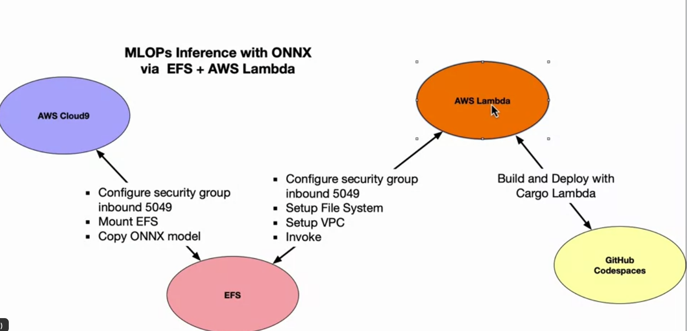

# Music-Classification-Rust
Classify lyrics using HF model in Rust

- [Rust GPU](nogibjj/rust-pytorch-gpu-template)
- carets io (rust based lib for machine learning)

## ONNEX
- package ml models
- use models between various frameworks

- 

## Additional Reading

|Title|Type|Length minutes|Brief Description|
|---|---|---|---|
|[Code examples in Rust MLOps Template](https://github.com/nogibjj/rust-mlops-template)|interactive Tutorial|30-60|Examples of many Rust MLOps projects for students to explore.|
|[Code examples in Rust PyTorch bindings](https://github.com/LaurentMazare/tch-rs)|Interactive Tutorial|30-60|Examples of PyTorch and Rust working together and worth students exploring.|
|[COde examples in Rust Stable Diffusion Repo](https://github.com/LaurentMazare/diffusers-rs)|Interactive Tutorial|30-60|Examples of Stable Diffusion and Rust working together and worth students exploring.|
|[Introduction to ONNEX](https://onnx.ai/onnx/intro/)|Documentation|5-10|The official documentation guide to ONNX, which is a portable model format that is increasingly important to learn.|
|[Using EFS with AWS Lambda](https://aws.amazon.com/blogs/compute/using-amazon-efs-for-aws-lambda-in-your-serverless-applications/)|Reading|5-10|An official guide to using EFS for AWS Lambda, helpful to look at the key touchpoints for configuring EFS.|
|[Rust for MLOps GitHub README project](https://docs.google.com/document/d/1Zp3K384gFMYYMx7nKCoWxTdLNv7KVaywivrGge7opnA/edit?usp=sharing)|Reading|5-10|A brief summary about the key reasons for Rust for MLOps.|

## HuggingFace Chatbot Arena
<b>Lab Description</b> In this hands-on lab, you'll use the ChatGPT Arena platform to compare two language models through natural conversation. Ask questions and provide subjective votes to benchmark model strengths.

### Steps

- Go to https://chat.lmsys.org/?arena and scroll down to the chat window.

- Pose questions, statements, or scenarios to Model A and Model B. Observe differences in responses.

- Continue the conversation by following up on model answers to identify a "winner".

- Submit a vote for the model you felt performed best in that round.

- Repeat steps 2-4 to continue benchmarking models across rounds.

### Reflection Questions

- Which models tended to perform better on what types of questions or scenarios?

- In what areas did models seem clearly stronger or weaker than others?

- How might you improve or expand on this benchmarking approach?

- How could side-by-side model comparison help your model development process?

- What additional or alternative ways could you envision leveraging ChatGPT Arena?

### Challenge Exercises

- Pose an open-ended subjective question and dig deeper into model differences over multiple turns.

- Think of niche test cases based on your domain to reveal model strengths and weaknesses.

- Identify top performers on the Arena Leaderboard - do their capabilities align with their ratings?

- Review the statistical rigor behind Arena score calculations in the methodology links.

- Consider designing your own head-to-head model benchmarking system inspired by Arena.

## Reflections
- <b>Summary:</b> In this lesson, we explored using Rust for MLOps by leveraging crates like RustBERT for transformer models and torch-rs for PyTorch GPU acceleration. We walked through examples like a Hugging Face translator, Stable Diffusion text-to-image generation, and ONNX model packaging. The lesson demonstrated Rust’s potential for performant and portable MLOps services.

### Key Takeaways:

- Rust crates exist for major ML frameworks like Hugging Face, PyTorch, and ONNX enabling high-performance model deployment.

- Solutions can harness GPUs for demands like Deep Learning via CUDA bindings available in Rust.

- It’s straightforward to package trained models via ONNX and deploy for cost-efficient inferencing like with AWS Lambda.

- Toolsets like torch-rs and Stable Diffusion access leading ML models and methods with Rust efficiency gains.

- Distroless containers created via Rust’s slim binaries increase security and reduce exploitation surface area.

### Reflection Questions:

- In what areas of MLOps or your model workflows could Rust provide the most impact over Python?

- How might leveraging GPU acceleration advance or improve your team’s ML initiatives?

- What additional Rust crates related to MLOps or your domain would add the most value?

- How does the ability to package trained models for portability via Rust change deployment strategies?

- For what types of ML workloads might Rust struggle compared to options you use today?

# Build Cloud Solutions with Rust

## Key Terms

- <b>Actix</b> - Rust web framework for building high-performance web services like microservices. Supports async and scalability.

- <b>App Engine</b> - GCP's fully managed serverless application platform. Supports Rust as a custom runtime option.

- <b>Cloud Run</b> - GCP product to run stateless containers in a fully managed environment. Integrates with Rust workflows.

- <b>Cargo Lambda</b> - Rust crate to help package, test, deploy and manage AWS Lambdas written in Rust.

- <b>Step Functions</b> - AWS service enabling serverless visual workflows by composing Lambda functions. Accessible via Rust SDK.

- <b>Tokio</b> - Asynchronous runtime for Rust providing non-blocking I/O scaling to tens of thousands tasks by leveraging threads.

- <b></b> - Amazon Elastic Container Service to launch Docker containers using AWS CLI or SDKs (including Rust).

- <b>ECR</b> - Amazon Elastic Container Registry providing managed and scalable Docker container storage integrated with Rust CI/CD.

- <b>Copilot</b> - CLI tool to streamline building, releasing and operating containerized apps on AWS services like ECS/ECR using Docker.

## Testing the microservices
- LOCUST: python lib
- load test an application
